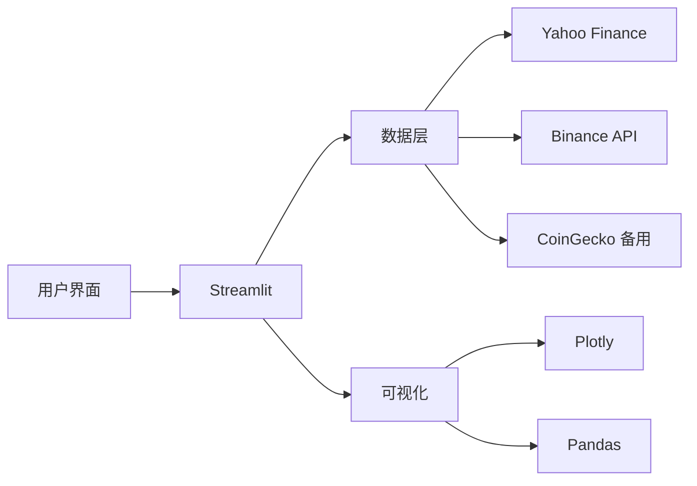

<div align="center">

# 📈 Fintech 市场波动扫描器

### 一款专为金融科学教育设计的实时市场分析工具

**让数据说话，让学习变得直观有趣 🎓**

[](https://share.streamlit.io/)
[](https://www.python.org/)
[](LICENSE)
[](https://github.com/flthy625-web/fintech-volatility-scanner)

[🚀 在线演示](https://share.streamlit.io/) · [📖 使用文档](#-使用指南) · [🎓 教学场景](#-教学应用场景) · [💬 反馈建议](https://github.com/flthy625-web/fintech-volatility-scanner/issues)

---

### 🌟 核心亮点

🔥 **真实市场数据** · 📊 **多维度分析** · 🎯 **智能波动识别** · 🌍 **三语切换** · 📱 **响应式设计**

</div>

---

## 🎯 项目愿景

> **让每一位金融专业学生都能在真实市场数据中学习和成长**

本项目是一款面向 **金融科技（FinTech）教育** 的专业工具，专门服务于：

<table>
<tr>
<td width="33%" align="center">
<h3>👨‍🎓</h3>
<h4>金融学专业学生</h4>
<p>帮助理论与实践结合</p>
</td>
<td width="33%" align="center">
<h3>💼</h3>
<h4>工商管理学生</h4>
<p>培养数据分析能力</p>
</td>
<td width="33%" align="center">
<h3>📊</h3>
<h4>量化金融爱好者</h4>
<p>探索市场规律</p>
</td>
</tr>
</table>

---

## ✨ 核心功能

### 🌍 三语切换支持

<table>
<tr>
<td align="center">🇨🇳<br/><b>简体中文</b></td>
<td align="center">🇹🇼<br/><b>繁體中文</b></td>
<td align="center">🇺🇸<br/><b>English</b></td>
</tr>
</table>

支持一键切换，满足不同地区学生的学习需求。

### 📊 多资产波动扫描

| 功能 | 说明 |
|------|------|
| 🎯 **多类资产支持** | 美股科技、指数、加密货币、外汇、大宗商品 |
| 📈 **实时波动率计算** | 年化波动率、ATR%、最大回撤、Z-Score |
| 🔍 **自动分类** | 低/中/高/极高 四档波动等级 |
| ⚡ **异常检测** | 基于 Z-Score 的异常行情识别 |

### 💰 Binance USDT 交易对监控

<div align="center">

```
┌─────────────────────────────────────────┐
│  🎯 智能过滤 → 按涨幅排序 → 状态分析    │
└─────────────────────────────────────────┘
```

</div>

**量价关系智能识别**：

| 状态 | 含义 | 触发条件 |
|:----:|:----|:---------|框架

</td>
<td width="50%">

**🔥 相关性热力图**
- 资产间联动关系
- 风险分散参考
- 颜色渐变直观展示

</td>
</tr>
</table>

### 🔔 智能告警系统

- ✅ 自定义波动率阈值（5% - 150%）
- ✅ Z-Score 异常检测（1.0 - 4.0）
- ✅ 实时预警提示
- ✅ 多级别告警（普通/警告/错误）

### ⚙️ 实时扫描

- 🔄 自动刷新（10-300 秒可调）
- 📊 扫描次数统计
- 🎯 可随时暂停/恢复
- 💾 智能数据缓存

---

## 🎓 教育应用场景

### 📚 四大教学主题

<details>
<summary><b>🎯 场景 1：理解流动性分层</b></summary>

**教学目标**：帮助学生理解市场流动性的重要性

**操作步骤**：
1. 调整"成交额过滤阈值"，从 100 万逐步提高到 5000 万
2. 观察每个阈值下的交易对数量变化
3. 对比不同流动性水平的币种特征

**学习要点**：
- ✅ 流动性越高，参与者越多，价格发现越有效
- ✅ 小市值币种流动性差，易受大单影响
- ✅ 大资金为什么选择主流币种

</details>

<details>
<summary><b>⚠️ 场景 2：识别量价背离风险</b></summary>

**教学目标**：学习量价关系的经典理论

**操作步骤**：
1. 获取 Binance 数据
2. 查看"波动状态"列
3. 找到标记为 ⚠️ 缩量背离 的币种
4. 对比 🚀 放量上涨 的币种

**学习要点**：
- ✅ 健康上涨 vs 风险上涨的区别
- ✅ 成交量是价格趋势的验证指标
- ✅ 如何规避追高风险

</details>

<details>
<summary><b>📉 场景 3：观察市场恐慌</b></summary>

**教学目标**：理解市场情绪对价格的影响

**操作步骤**：
1. 筛选"仅下跌"的币种
2. 观察是否有 📉 放量下跌 状态
3. 查看 24h 振幅和涨跌幅

**学习要点**：
- ✅ 放量下跌通常伴随恐慌性抛售
- ✅ 高振幅反映市场情绪剧烈波动
- ✅ 市场情绪如何影响价格

</details>

<details>
<summary><b>🔗 场景 4：相关性与分散投资</b></summary>

**教学目标**：掌握现代投资组合理论

**操作步骤**：
1. 选择多个资产（BTC、ETH、BNB 等）
2. 切换到"相关性矩阵"标签
3. 分析热力图中的颜色分布

**学习要点**：
- ✅ 相关性接近 1：同涨同跌
- ✅ 相关性接近 -1：反向波动
- ✅ 分散投资的科学依据

</details>

---

## 🚀 快速开始

### 💻 本地运行

```bash
# 1. 克隆仓库
git clone https://github.com/flthy625-web/fintech-volatility-scanner.git
cd fintech-volatility-scanner

# 2. 安装依赖
pip install -r requirements.txt

# 3. 启动应用
streamlit run app.py
```

访问 `http://localhost:8501` 开始使用！

### ☁️ 云端部署（推荐）

**一键部署到 Streamlit Cloud**：

1. Fork 本仓库到你的 GitHub
2. 访问 [share.streamlit.io](https://share.streamlit.io/)
3. 选择你的 Fork
4. 点击 Deploy

> ✨ 优势：无需安装环境、全球访问、无地区限制

### 🍎 macOS 应用

项目还提供了可双击打开的 macOS 应用包：

```bash
# 首次使用
open ~/fintech-volatility-scanner/Fintech教育App.app
```

---

## 🛠️ 技术架构

<div align="center">



</div>

### 📦 核心依赖

| 技术 | 作用 | 版本 |
|------|------|------|
| **Streamlit** | Web 应用框架 | >=1.32.0 |
| **Pandas** | 数据处理 | >=2.0.0 |
| **NumPy** | 数值计算 | >=1.24.0 |
| **Plotly** | 交互式图表 | >=5.18.0 |
| **yfinance** | 股票数据 | >=0.2.36 olatility-scanner/
│
├── 📄 app.py                      # 主应用入口
├── 📂 pages/                      # 多页面应用
│   └── 1_学习中心.py              # 金融知识库
├── 📂 modules/                    # 功能模块
│   ├── __init__.py
│   └── i18n.py                   # 多语言支持
├── 📂 locales/                    # 翻译文件
│   ├── zh_CN.json                # 简体中文
│   ├── zh_TW.json                # 繁体中文
│   └── en_US.json                # 英文
├── 📂 data/                       # 数据目录
│   ├── courses/                  # 课程内容
│   └── quizzes/                  # 测验题库
│
├── 📄 requirements.txt            # Python 依赖
├── 📄 README.md                   # 项目说明
├── 📄 EDUCATION_UPGRADE_PLAN.md   # 教育升级规划
├── 📄 macOS_使用说明.md           # macOS 使用指南
└── 📄 LICENSE                     # MIT 开源协议
```

---

## 🎨 界面预览

<div align="center">

### 🌈 精心设计的深色主题

**主仪表盘** · **量价分析** · **相关性矩阵** · **告警系统**

*所有界面均支持三种语言切换，界面简洁优雅*

</div>

---

## 🌟 特色功能

### ✅ 已实现功能

- [x] 🎯 多资产波动扫描
- [x] 💰 Binance USDT 交易对监控
- [x] 📊 量价状态智能识别
- [x] 🔥 相关性热力图
- [x] ⚡ 实时自动刷新
- [x] 🌍 三语切换（中简/中繁/英）
- [x] 📚 金融知识学习中心
- [x] 🎨 深色主题设计
- [x] 📱 响应式布局
- [x] 💾 数据导出 CSV

### 🚧 开发中功能

- [ ] 📝 互动式知识测验
- [ ] 🎮 模拟交易系统
- [ ] 📈 K 线技术分析指标
- [ ] 🏆 学习成就系统
- [ ] 👥 社区分享功能

### 🔮 未来规划

- [ ] 📊 更多技术指标（MACD、RSI、布林带）
- [ ] 🤖 AI 智能分析
- [ ] 📱 移动端专属优化
- [ ] 🌐 更多语言支持（日语、韩语）

---

## ⚠️ 重要声明

<div align="center">

> ### 📚 **本工具仅供教育和学习使用**

</div>

- ✅ **教育目的**：帮助学生理解金融市场运作机制
- ✅ **数据来源**：仅供研究参考，不应作为投资决策依据
- ⚡ **市场风险**：加密货币市场波动极大，投资需谨慎
- 💼 **自负盈亏**：任何基于本工具的投资决策，风险自担

---

## 🤝 贡献指南

我们欢迎所有形式的贡献！

<table>
<tr>
<td width="25%" align="center">
<h3>🐛</h3>
<b>报告 Bug</b>
<br/>
<a href="https://github.com/flthy625-web/fintech-volatility-scanner/issues">提交 Issue</a>
</td>
<td width="25%" align="center">
<h3>💡</h3>
<b>功能建议</b>
<br/>
<a href="https://github.com/flthy625-web/fintech-volatility-scanner/issues">分享想法</a>
</td>
<td width="25%" align="center">
<h3>📝</h3>
<b>完善文档</b>
<br/>
提交 PR 改进文档
</td>
<td width="25%" align="center">
<h3>🔧</h3>
<b>代码贡献</b>
<br/>
Fork & Pull Request
</td>
</tr>
</table>

### 开发流程

```bash
# 1. Fork 本仓库
# 2. 创建特性分支
git checkout -b feature/amazing-feature

# 3. 提交更改
git commit -m "feat: 添加某某功能"

# 4. 推送分支
git push origin feature/amazing-feature

# 5. 创建 Pull Request
```

### 提交规范

- `feat`: ✨ 新功能
- `fix`: 🐛 修复 Bug
- `docs`: 📚 文档更新
- `style`: 💄 代码格式
- `refactor`: ♻️ 代码重构
- `test`: ✅ 测试相关
- `chore`: 🔧 构建工具

---

## 📜 开源协议

本项目采用 [MIT License](LICENSE) 协议。

```
MIT License - 可以自由使用、修改、分发
唯一要求：保留原作者版权声明
```

---

## 👨‍💻 作者

<div align="center">

**flthy625-web**

[](https://github.com/flthy625-web)
[](mailto:your-email@example.com)

*专注于金融科技教育工具开发*

</div>

---

## 🙏 致谢

感谢以下优秀的开源项目：

- 🎈 [Streamlit](https://streamlit.io/) - 让 Python 应用开发变得简单
- 📊 [Plotly](https://plotly.com/python/) - 美观的交互式图表
- 🐼 [Pandas](https://pandas.pydata.org/) - 强大的数据处理
- 📈 [yfinance](https://github.com/ranaroussi/yfinance) - Yahoo Finance 数据接口
- 💰 [Binance](https://www.binance.com/) - 加密货币数据
- 🦎 [CoinGecko](https://www.coingecko.com/) - 备用数据源

特别感谢所有为金融教育做出贡献的开发者和教育者。

---

## 🔗 相关链接

- 📖 [项目文档](https://github.com/flthy625-web/fintech-volatility-scanner)
- 🚀 [在线演示](https://share.streamlit.io/)
- 💬 [反馈建议](https://github.com/flthy625-web/fintech-volatility-scanner/issues)
- ⭐ [给项目 Star](https://github.com/flthy625-web/fintech-volatility-scanner)

---

<div align="center">

### 💖 如果这个项目对你有帮助，请给个 ⭐ Star 支持一下！

**Made with ❤️ for FinTech Education**

*让每一位金融学生都能轻松掌握市场分析*

---

<sub>📅 最后更新: 2026年5月 | 🔄 持续维护中 | 🎓 面向教育</sub>

</div>
